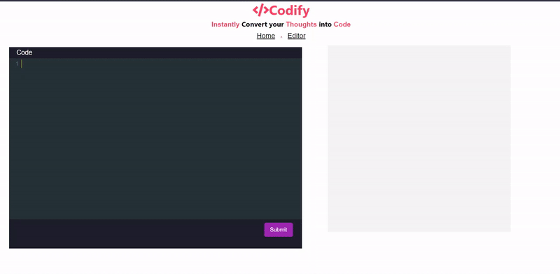

# Codify

Codify stands for a smart intelligent system that can code like a human being for a data science application. It enables data scientists to perform all the tedious and time-consuming tasks such as EDA (exploratory data analysis), data cleaning, data pre-processing, data visualization, modeling, and evaluation in the data-science life cycle, by only conveying the logic of the task in natural language (English query) and the system will automatically give out all the relevant python code snippets, or in other words the user just needs to type what they want in the form of a natural language query (English), and our system will automatically give out all the relevant code snippets in python for it.

<br>


### [Click here](https://dx.doi.org/10.2139/ssrn.4111759) to read our paper, published on **SSRN** 


## [Dataset Stats]()


| Parameter | Statistics |
| -------- | ----------- | 
| Total Number of Users Queries | 525 |
| Total Number of Unique Intents | 20 |
| Total Number of  Unique Entity | 10 |
| Total Number of  Unique Python Code Snippets | 100 |


## [Intent Classification](https://github.com/Elysian01/Intent-Classification-Benchmark)

### Comparison among Several Approachs for Intent Classification.


| Sr. No | Method                       | Accuracy | Paper                                                                       | Year     |
| ------ | ---------------------------- | -------- | --------------------------------------------------------------------------- | -------- |
| 1.     | Sum of Word Embedding (Citation Word Embedding) | 88.60% | [Paper](https://ieeexplore.ieee.org/ielx7/6287639/9312710/09319154.pdf)    | Jan 2021 |   
| 3.     | Facebook InferSent| 87.34% | [Paper](https://arxiv.org/pdf/1705.02364.pdf)                               | Jul 2018 |
| 2.     | Semantic Subword Hashing| 78.48%  | [Paper](https://arxiv.org/abs/1810.07150)                                   | Sep 2019 |
| 4.     | TF-IDF (Citation Word Embedding) | 74.68% | [Paper](https://ieeexplore.ieee.org/ielx7/6287639/9312710/09319154.pdf)   |Jan 2021 |


## [Custom-NER-using-Spacy](https://github.com/Elysian01/Custom-NER-using-Spacy)
Custom Named Entity Recognition annotated using NER Annotated by tecoholic and Spacy for training the model

## Get Started

[Download](https://drive.google.com/drive/folders/1-gWCai8P_kkcuBMKd4WyTVPI0drsV6rP?usp=sharing) glove embeddings folder and place it inside "./codify/intent_word_emb" folder

[Download](https://drive.google.com/drive/folders/1khbEs2sj4a3tKqCpH-AvN1siFkYdEhYX?usp=sharing) entity recognition model folder and place it inside "./codify/models" folder

Activate your environment
```bash
conda activate codify_env
```

Run Python Server 
```bash
python server.py
```

Run React App
```bash
cd client/
```
```bash
npm start
```

## Credits

* NER Annotator -  https://github.com/tecoholic/ner-annotator
* `spacy` - https://github.com/explosion/spaCy
* Custom NER for Extracting Disease Entities Blog - https://medium.com/analytics-vidhya/custom-ner-for-extracting-disease-entities-c620aca2e1bb
